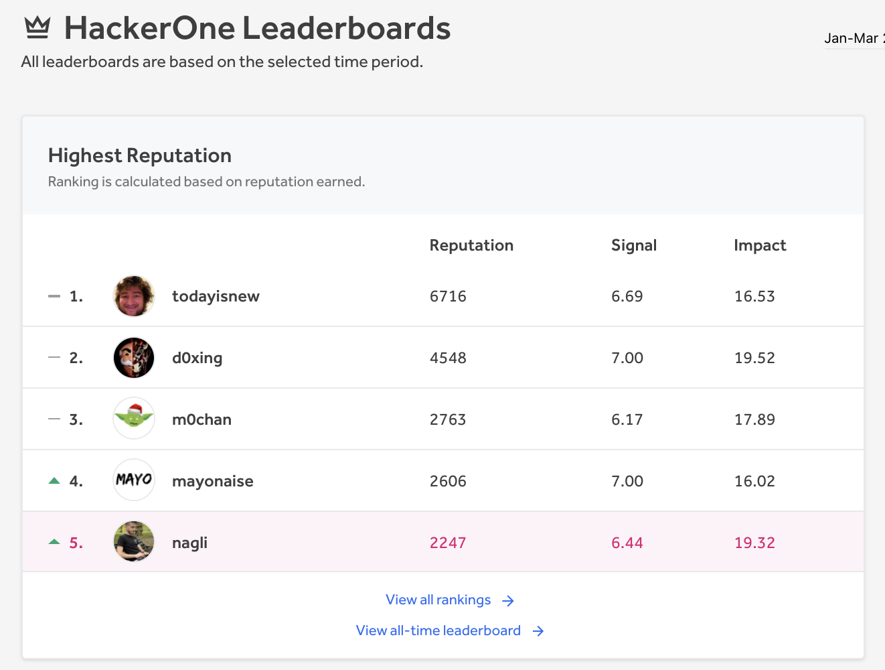
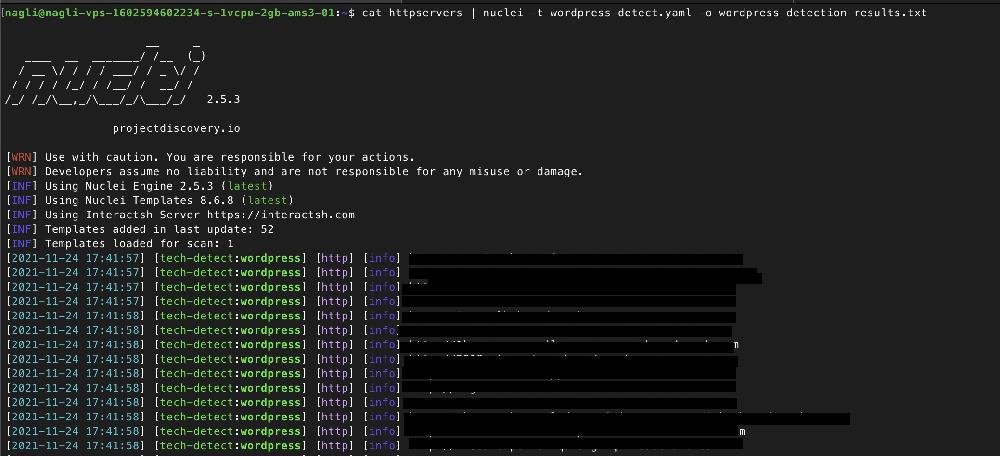
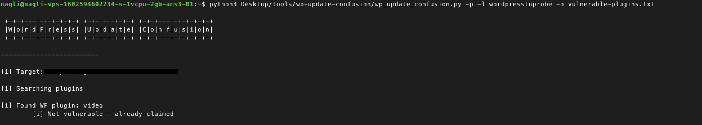
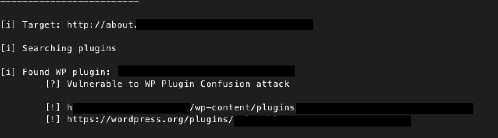
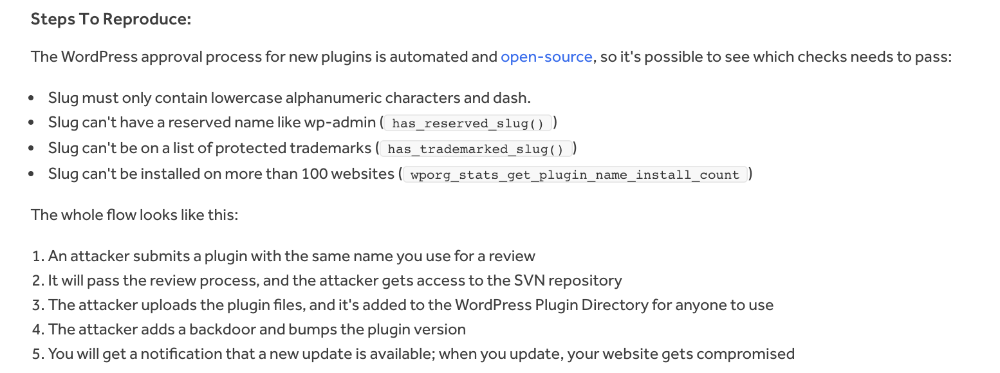
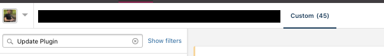
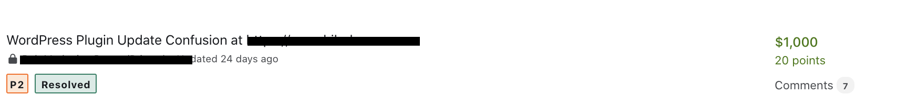

## General

Please make sure you visit the [Official Publication](https://vavkamil.cz/2021/11/25/wordpress-plugin-confusion-update-can-get-you-pwned/)

A couple of month ago while browsing twitter on a weekend I submled upon a rather interesting post from [@vavkamil](https://twitter.com/vavkamil/status/1447160385954533378), looks like he had a pretty productive session while hacking and was showing off his rather impressive series of 0 day submissions in a small time span.

During the last few month of me doing bug bounties I started hopping in a nice amount of collaborations which helped me and my peers greatly to boost up our Bug Bounty rewards and quallity findings, and helped me personally reach new heights on [HackerOne Leaderboard](https://hackerone.com/leaderboard) being as up as 5th place on Q4 while writing this blog.



The collaborations I'm taking part of are pretty straight forward, I reach out to friends or rather they reach out to me after they/I found some kind of unique 0/1 day that affects many instances on popular 3rd party services.

Usually after the collaborator finalized his scans and concluded his research while reporting his unique bug to as many vulnerable assets that he could find, we offer the chance to help and scan our own database of Bug Bounty programs in exchange of even split for the rewards, this is a 100% Win Win situation as:

* Original finder concluded his research and finalized his scanning process.

* CVE's / Unique findings tend to get public and leaked pretty fast.

* The scanning process can to identify the specific affected product, without sharing the payload at all.

As I didn't know [@vavkamil](https://twitter.com/vavkamil) from past encounters, I reached out to him on twitter offering him a collaboration of which I will scan my bounty targets database to identify targets running behind WordPress.

[@vavkamil](https://twitter.com/vavkamil) was incredibly professional and polite and agreed to hop in with me right away sharing his private github repo where he stored his WordPress Plugin Update Confusion python scanner.

While going through his code and explanation I grasped that this bug is really cool and unique, and with the potenital to affect some really big Bug Bounty programs because there are over 450M websites in the internet powered by WordPress, and it's mostly used to serve blogs or rather the official marketing websites at www.{target}.com

Now, after we had a chat for a bit it was time for me to work and find as much vulnerable targets as I could, so It's time to dive deep into the process and how you can scan for it yourself wether you are a Bug Bounty hunter or Application Security Engineer

The workflow will look like the following:

Finding all the Bug Bounty subdomains running behind WordPress => Feeding them to the wp-update-update-confusion scanner => Creating a report template to east the process reporting to large amount of programs.

During the process I reported the issue to 43 HackerOne programs and ~10 on BugCrowd, and received a wide variety of responses ranging from Informatives to Rewards + Bonuses, also there is still quite a good amount of Triaged reports who are yet to reach a conclusion.

## Prerequisites

* Follow the steps at [wp-update-confusion Repo](https://github.com/vavkamil/wp-update-confusion) to set up the scanner

* Make sure you have [nuclei](https://github.com/projectdiscovery/nuclei) installed, we will use it in order to identify websites running WordPress.

## Fingerprinting Phase

Now as wev'e completed the previous phase we are ready to fingerprint our assets.

Nuclei has a good template for identifying websites powered by certain technologies in general that can be found [here](https://github.com/projectdiscovery/nuclei-templates/blob/master/technologies/tech-detect.yaml), I extracted from this list wordpress only as a matcher and you can find it at [wordpress-detect.yaml](https://github.com/vavkamil/wp-update-confusion/blob/main/wordpress-detect.yaml)

After we installed our template we can store it on our root directory.

Now, we want to executing the nuclei template on our known Bug Bounty http servers.

The command is pretty simple and straight forward, and looks like:

```
cat httpservers | nuclei -t wordpress-detect.yaml -o wordpress-detection-results.txt
```




## Scanning

After the Fingerprinting scan is finished, we should have a list of the targets identified to be powered by WordPress.

A quick one liner to filter the results straight for wp-update-confusion.py script can be used as:

```
cat wordpress-detection-results.txt | cut -d " " -f 6 > wordpress-targets-to-probe.txt
```

Now we are being left with a file which stored a subdomain list that can be directly fed into the update confusion scanner.

The following scanner command accepts a list of subdomains and scans for vulnerable plugins presented on the selected subdomain, for more information on the steps the scanner makes to identify a valid confusion case, please visit the [Technical Blog](https://vavkamil.cz/2021/11/25/wordpress-plugin-confusion-update-can-get-you-pwned/)

```
python3 wp-update-confusion/wp_update_confusion.py -p -l wordpresstoprobe -o vulnerable-plugins.txt
```



As you can see from the provided image, the scan provides verbosity to see while running wether the plugins identified in our targets are up for claim and can be registered on the wordpress.org website as public plugin.

there are 2 states:

* Not vulnerable - {{Explanation}} - which means we can't claim the plugin for vairous of reasons (already claimed, pro version and more...)

* Vulnerable -  Found WP plugin: redacted-blocks which means that the plugin is vulnerable, and we can register it at [wordpress.org/plugins/developers](https://wordpress.org/plugins/developers/)



On the scan's output file we will see the affected subdomains, and the name of the plugin as the path, similar to

```
http://about.redacted.com/wp-content/plugins/redacted-blocks
```

And that's should wrap the Fingerprinting and Scanning process, we now have results of vulnerable plugins ready to be claimed.

The whole explanation can be summed up to the following one liner:

```
cat httpservers | nuclei -t wordpress-detect.yaml -o wordpress-detection-results.txt && cat wordpress-detection-results.txt | cut -d " " -f 6 > wordpress-targets-to-probe.txt && python3 wp-update-confusion/wp_update_confusion.py -p -l wordpresstoprobe -o vulnerable-plugins.txt
```

I won't go through the claiming process in this blog, as it's detailed in @vavkamil's one.

## Constructing the report template

Now comes one of the most crucial parts within this research, and it's the stage where we need to build our report to explain the issue providing as much detailed report as we can in order to assist to the Bug Bounty platforms triagers and the Bug Bounty Programs managers to fully understand the issue.

This is the template structure that we chose to go with:

* Summary: we gave a few words about this being a novel attack, and that it's similar by it's nature to the recent [Dependency Confusion](https://medium.com/@alex.birsan/dependency-confusion-4a5d60fec610) attack. we also shared the fact that we wrote a custom scanner that detects the issue and shared it with the triage team, specifying the specific plugin name which is up for grabs at the WordPress Website

* Steps To Reproduce: We explained the WordPress approval process for new plugins, how it's automated and the various slugs that it auto rejects (explaining how we avoided false positives before the report), and the flow of the attack



* Mitigation: We provided details on the mitigation, which is well explained at vavkamil's blog, and is really easy to fix for the Program Managers, it includes adding a small header comment as Update URI:false on the main PHP file.

### Conclusion

This was a great experience for me to collaborate on such a well thought bug, even though the responses were mixed, and sometimes it was hard to explain the issue - there were some really great programs that patched the issue quickly and were really nice to work with.

With every new collaboration you get to learn more AppSec wise, develop your communication and teamwork skills and in the process earn some bounties and make the prevent some internet breaches in the sideways, so I couldn't advise more on collaborating - it is a gamechanger.







## Thanks for sticking out!

Some Social Links:

* [Twitter](https://twitter.com/naglinagli)
* [HackerOne](https://hackerone.com/nagli)
* [Bugcrowd](https://bugcrowd.com/Nagli)
* [Linkedin](https://www.linkedin.com/in/galnagli)
